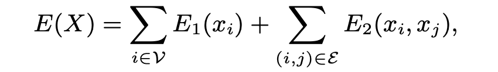
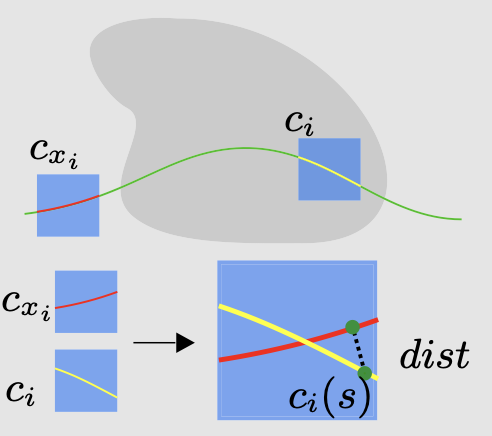
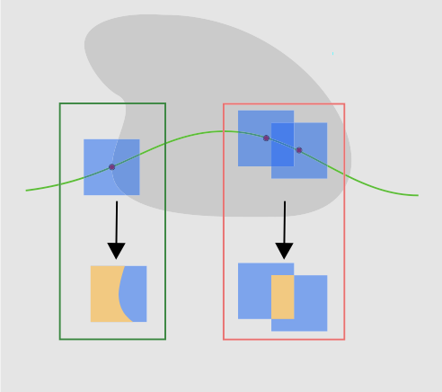
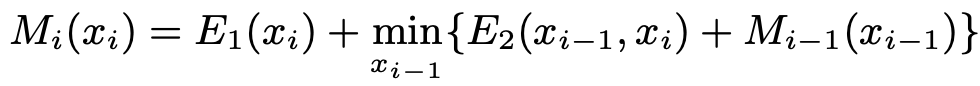
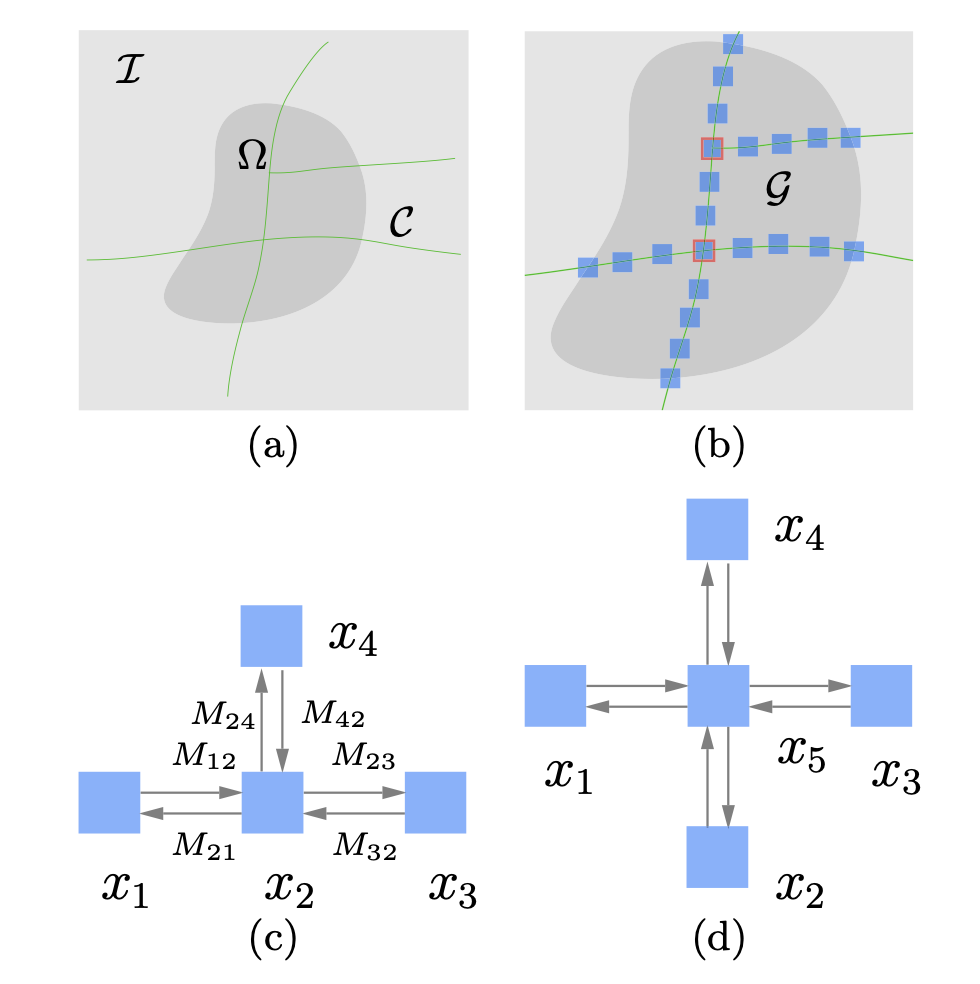
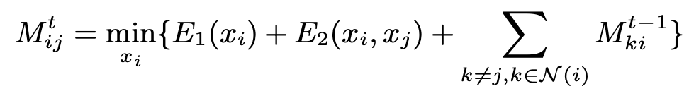
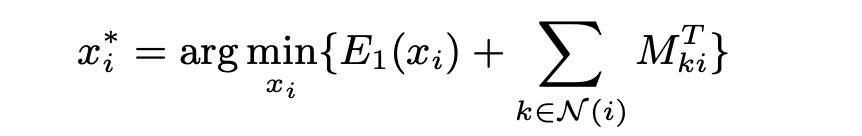
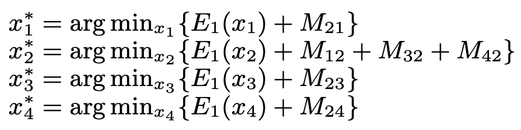
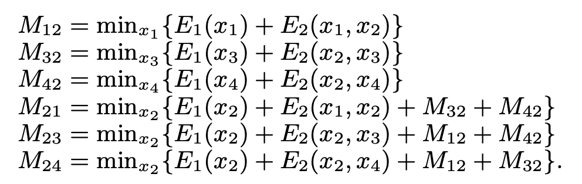

# Image Completion with Structure Propagation

## 成员

| 姓名   | 学号       |
| ------ | ---------- |
| 苏厚先 | 3200102706 |
| 刘思锐 | 3200102708 |

## 项目内容

用户在界面中画出待补全的区域以及结构线，本算法在已知图像区域采样，选取最匹配图像块将空洞区域补全。

### 用户界面

项目启动方法为：

`$ /path/to/ImageCompletion  ./source_file ./save_path`

工程实现了两个图形化用户界面：

### 结构补全

传统计算机程序无法推测图片缺失区域的物体轮廓，比如在这个例子中：

因此图像补全的第一步是用户手动画出结构线指示图像内物体的边缘；算法在结构线上的已知区域内采样，填补结构线上的未知区域，以此补全物体的结构轮廓。

### 纹理补全

经过结构补全，缺失的块中应该不含有结构轮廓信息，此时算法会在

### 光测度一致性矫正

光测度一致性矫正使用与泊松图像编辑相似的原理。

## 理论分析

### 结构补全

结构补全要求“对结构线上每一个未知的块，在结构线上已知的部分中挑选一个最合适的块填充到此处”，显然是一个优化问题。

#### 优化函数

我们定义优化函数如下：

其中$E_S$衡量结构线方向的相似程度。将待填补的方块$c_i$与当前选取的已知方块$c_{xi}$重叠，将两者的结构线逐像素采样，计算到另一条结构线的最短距离，并将结果加和。此项的值越小说明所选的块与待填补的块结构越相近。

$E_I$衡量新填补的块与已知区域的相似程度。如果填补的方块与已知区域有重叠（如下图中绿色所示），则将重合区域逐像素采样，计算所选的块与已知边缘灰度的标准化平方差（SSD）。此项的值越小说明所选的块与已知边缘越相近，补全效果越自然。与已知区域没有重叠的未知区域，此项的值为0。

$E_2$衡量前后两个填补块之间的相似程度。如果两个先后填补的块之间有重叠（如上图中红色所示），则将两者的重合部分逐像素采样，计算两者灰度的SSD。此项的值越小说明当前填补的块与前一个块的纹理越相近，结构线越平滑。

#### 优化算法

当结构线间没有交叉时，因为$E_2$的计算只与此前一个补全的块有关，我们很容易用一个一维的动态规划（BP）得到结构线上每个点的最优解：

但是当结构线之间有交叉，形成十字形的结构时，一方面，不同的补全顺序将影响到交叉处的$E_2$计算；另一方面，通过DP遍历十字形结构线四个方向上的已知信息找出最优解的计算量非常大（指数级，在参考论文[1]中给出了证明）。因此当结构线存在交叉时，我们使用信念传播（BP）的方法进行计算。

信念传播是一种本地消息传递算法，它可以最小化任何无向成对图上定义的能量函数，例如我们的E(X)。信念传播的基本机制是图中的每个节点接收来自其邻居的消息，然后将更新的消息发送回每个邻居。我们将从节点i到j发送的消息表示为Mij，它是一个具有N个元素的向量。Mij表示节点i相信节点j具有相应标签xj的概率。上图展示了用于图像完成的信念传播的主要过程。

信念传播有两个版本：和乘积求和（sum-product）以及最大乘积（max-product）。求和乘积计算每个节点的边缘后验概率，而最大乘积则最大化每个节点的后验概率。在本算法中，我们使用最大乘积与负对数概率，将最大乘积转化为最小和（min-sum）。

比如在上图(c)中，传播过程为：

其中M的计算如下：

对于一个包含循环的图形，我们仍然可以使用BP算法而不需要担心环形传播导致算法死循环。对于一个只有一个循环的图形，参考论文[3]已经证明如果最大乘积置信传播算法收敛，将得到最优解。对于一个包含多个循环的图形，循环置信传播通常在收敛时得到一个局部最小值。在我们的实验中，BP算法的表现良好。

### 纹理补全

### 光测度一致性矫正

## 实现细节

### 用户界面

#### Mask绘制界面

Mask绘制界面主要依赖鼠标回调函数实现；

#### 结构线绘制界面

### PointManager

### 结构补全

#### DP

#### BP

### 纹理补全

### 光测度一致性矫正

## 结果展示

## 参考文献

