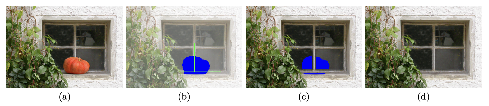

# Image Completion with Structure Propagation

## 成员

| 姓名   | 学号       |
| ------ | ---------- |
| 苏厚先 | 3200102706 |
| 刘思锐 | 3200102708 |

## 项目内容

用户在界面中画出待补全的区域以及结构线，本算法在已知图像区域采样，选取最匹配图像块将空洞区域补全。

### 用户界面

项目启动方法为：

`$ /path/to/ImageCompletion  ./source_file ./save_path`

工程实现了两个图形化用户界面：

### 结构补全

传统计算机程序无法推测图片缺失区域的物体轮廓，比如在这个例子中：

因此图像补全的第一步是用户手动画出结构线指示图像内物体的边缘；算法在结构线上的已知区域内采样，填补结构线上的未知区域，以此补全物体的结构轮廓。

### 纹理补全

经过结构补全，缺失的块中应该不含有结构轮廓信息，此时算法会在

### 光测度一致性矫正

## 理论分析

### 结构补全

结构补全要求“对结构线上每一个未知的块，在结构线上已知的部分中挑选一个最合适的块填充到此处”。

### 纹理补全

### 光测度一致性矫正

## 实现细节

### 结构补全

### Pointmanager

### 纹理补全

### 光测度一致性矫正

## 结果展示

## 参考文献

